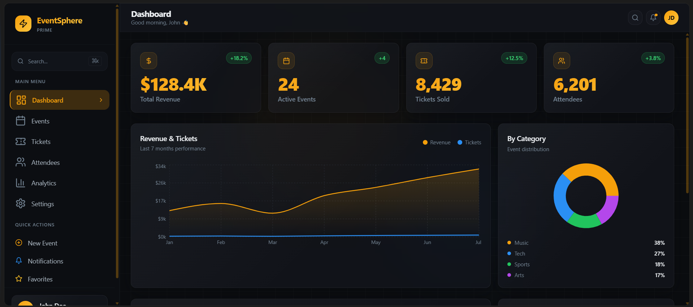
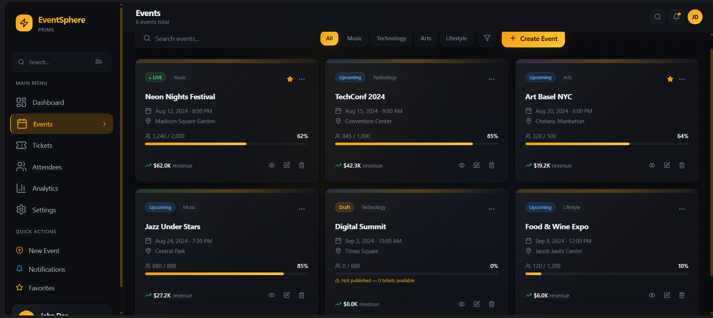
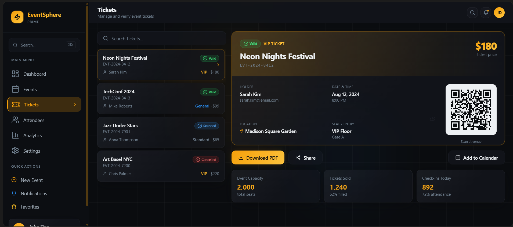
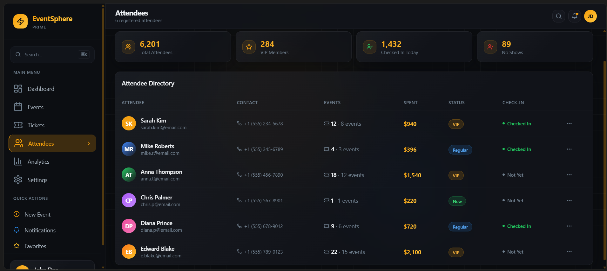
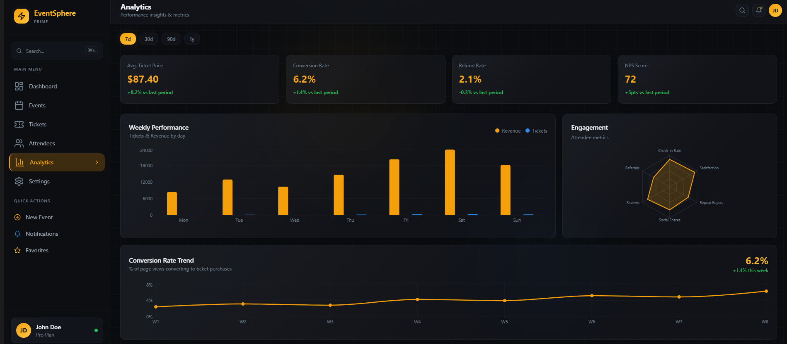
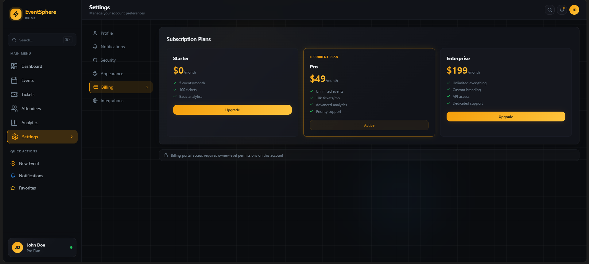

# Event Registration and Ticketing Platform

A full-stack, enterprise-grade Event Management and Ticketing system designed for high scalability and secure concurrent bookings. Built with a Go-powered backend and a modern React frontend, this platform offers a seamless experience for both event organizers and attendees.

## 📖 Problem Statement

In the digital age, event organizers face challenges in managing large-scale registrations, preventing overbooking in high-demand scenarios, and ensuring secure ticket distribution. Traditional systems often fail under heavy concurrent load or lack integrated features like real-time analytics and automated QR-based ticket verification.

This platform was built to solve these challenges by providing:
- **Scalable Infrastructure**: A robust Go backend capable of handling high traffic.
- **Data Integrity**: Guaranteed seat availability through advanced concurrency control.
- **Security**: Granular Role-Based Access Control (RBAC) and JWT-based authentication.
- **Engagement**: Automated email notifications and a sleek user interface.

## ✨ Key Features

- **🛡️ Role-Based Access Control (RBAC)**: Distinct permissions for Admins (manage events, users, analytics) and Users (browse, register, manage tickets).
- **⚡ Concurrent-Safe Booking**: Implementation of database-level pessimistic locking (`FOR UPDATE`) to ensure zero overbooking.
- **🎫 Digital Ticketing**: Automatic PDF ticket generation featuring unique QR codes for secure entry.
- **📊 Analytics Dashboard**: Comprehensive insights into event performance, registration trends, and system health.
- **📧 Automated Notifications**: Email confirmations, RSVP updates, and event reminders.
- **🏗️ Layered Architecture**: Clean, maintainable code following the Repository-Service-Handler pattern.
- **🔍 Search & Filtering**: Advanced search capabilities for events based on categories and availability.

## 🛠️ Tech Stack

### Backend
- **Language**: Go 1.25+
- **Framework**: Gin (Web Framework)
- **ORM**: GORM (Object-Relational Mapping)
- **Auth**: JWT (JSON Web Tokens)
- **Logging**: Zap & Logrus
- **Task Management**: Worker Pool for async operations (email, PDF generation)

### Frontend
- **Framework**: React 18+ with TypeScript
- **Bundler**: Vite
- **Styling**: Tailwind CSS & Framer Motion (Animations)
- **UI Components**: Shadcn UI (Radix UI based)
- **State Management**: TanStack Query (React Query)

### Database & Tools
- **Database**: PostgreSQL
- **Caching**: In-memory Go-Cache
- **Containerization**: Docker (Optional)

## 🏢 Folder Structure

```text
event-ticketing-system/
├── backend/                # Go Backend Service
│   ├── cmd/api/            # Entry point (main.go)
│   ├── internal/           # Core logic (Handlers, Services, Repositories)
│   ├── pkg/                # Shared utilities (Email, PDF, Utils)
│   ├── uploads/            # Static image assets
│   └── go.mod              # Backend dependencies
├── frontend/               # React Frontend Application
│   ├── src/                # Component architecture
│   │   ├── components/     # Reusable UI elements
│   │   ├── pages/          # View components
│   │   └── hooks/          # Custom React hooks
│   ├── package.json        # Frontend dependencies
│   └── tailwind.config.ts  # Styling configuration
└── README.md               # Project documentation
```

## 🚀 Getting Started

### Prerequisites
- [Go](https://go.dev/dl/) (1.25+)
- [Node.js](https://nodejs.org/) (20+)
- [PostgreSQL](https://www.postgresql.org/download/)

### 1. Clone the repository
```bash
git clone https://github.com/username/event-ticketing-system.git
cd event-ticketing-system
```

### 2. Backend Setup
```bash
cd backend
cp .env.example .env
# Update .env with your database credentials
go mod download
go run cmd/api/main.go
```

### 3. Frontend Setup
```bash
cd ../frontend
cp .env.example .env
npm install
npm run dev
```

## 🔐 Environment Variables

### Backend (`backend/.env`)
| Variable | Description | Default |
|----------|-------------|---------|
| `PORT` | API Port | `8080` |
| `DB_HOST` | Postgres Host | `localhost` |
| `DB_NAME` | Database Name | `event_ticketing` |
| `JWT_SECRET` | Secret for JWT signing | `Required` |

### Frontend (`frontend/.env`)
| Variable | Description | Value |
|----------|-------------|-------|
| `VITE_API_URL` | Base API Endpoint | `http://localhost:8080/api/v1` |

## 📡 API Endpoints (v1)

### Authentication
- `POST /api/v1/auth/register` - Create new account
- `POST /api/v1/auth/login` - Authenticate & receive JWT

### Events
- `GET /api/v1/events` - List all events
- `GET /api/v1/events/:id` - Detailed event information
- `POST /api/v1/admin/events` - (Admin) Create new event

### Registrations
- `POST /api/v1/registrations` - Book a ticket
- `GET /api/v1/registrations` - View my tickets


## 📸 Application Screenshots

### Dashboard


### Events


### Tickets


### Attendees


### Analytics


### Settings


## 🛡️ Concurrency Handling

The platform implements **Pessimistic Locking** to handle high-concurrency ticket bookings. When a user attempts to register:
1. The system initiates a database transaction.
2. It executes `SELECT ... FOR UPDATE` on the specific event row, locking it from other modifications.
3. The available seat count is validated.
4. If seats remain, the count is decremented and the registration is committed.
This ensures that even if 1,000 users click "Register" simultaneously for the last seat, only one will succeed, and the count will never go below zero.

## 🔮 Future Improvements

- [ ] Implementation of Redis for distributed caching.
- [ ] Integration with payment gateways (Stripe/Razorpay).
- [ ] Real-time seat selection with WebSockets.
- [ ] Mobile application built with React Native.

## ✍️ Author

**Your Name**
- GitHub: [@Ishwaris_profile](https://github.com/Ishwarij032005)
- LinkedIn: [Ishwari_Jamadade](https://www.linkedin.com/in/ishwari-jamadade-99b383297/)

---
*Built for excellence.*
